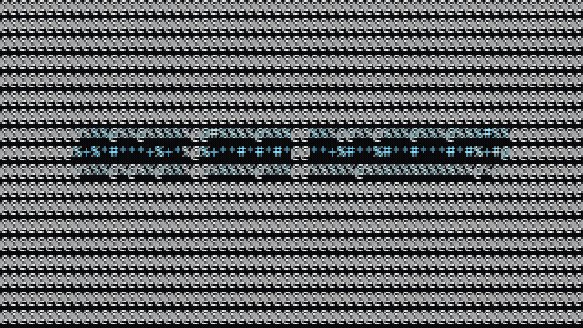

# ascii-colorizer

Rust CLI that converts images and videos into colored ASCII art for terminal display.

## Demo



Source clip: [Big Buck Bunny trailer](https://peach.blender.org/) (CC BY 3.0, Blender Foundation). [Full demo video](demo.mp4).

## Requirements

- A terminal with ANSI color support (TrueColor recommended)
- [ffmpeg](https://ffmpeg.org/) and `ffprobe` on `PATH` for video input

## Install

### Prebuilt binaries (recommended)

Download the archive for your platform from [GitHub Releases](https://github.com/Cod-e-Codes/ascii-colorizer/releases), verify the SHA256 checksum, extract it, and place the binary on your `PATH`.

| Platform | Asset name pattern |
| --- | --- |
| Windows (x86_64) | `ascii-colorizer-x86_64-pc-windows-msvc.zip` |
| Linux (x86_64) | `ascii-colorizer-x86_64-unknown-linux-gnu.tar.gz` |
| Linux (ARM64) | `ascii-colorizer-aarch64-unknown-linux-gnu.tar.gz` |
| macOS (Intel) | `ascii-colorizer-x86_64-apple-darwin.tar.gz` |
| macOS (Apple Silicon) | `ascii-colorizer-aarch64-apple-darwin.tar.gz` |

Releases are published when a version tag is pushed (for example `v0.1.4`). See [latest release](https://github.com/Cod-e-Codes/ascii-colorizer/releases/latest).

### Install with Cargo

```bash
cargo install --git https://github.com/Cod-e-Codes/ascii-colorizer.git --tag v0.1.4 --locked
```

### Build from source

```bash
git clone https://github.com/Cod-e-Codes/ascii-colorizer.git
cd ascii-colorizer
cargo build --release
```

The binary is at `target/release/ascii-colorizer` (`.exe` on Windows).

## Usage

Image:

```bash
ascii-colorizer --file ./image.png
ascii-colorizer --file ./image.png --width 120 --detailed --color no-color
```

Video (live playback in terminal):

```bash
ascii-colorizer --file ./video.mp4 --type video --fps 12 --width 120 --color truecolor
```

Video (save to file):

```bash
ascii-colorizer --file ./video.mp4 --type video --fps 10 --save output.txt
```

Notes:

- Video output is streamed frame by frame to avoid loading all frames into memory. Frame pixel and ASCII buffers are reused across frames to reduce allocations during playback.
- Saved video output uses a form feed separator between frames.
- Live playback runs in an alternate terminal screen and restores the previous screen on exit.
- Ctrl+C exits video playback cleanly and restores terminal state.

## CLI options

| Option | Description |
| --- | --- |
| `-f, --file <FILE>` | Input file path |
| `-w, --width <WIDTH>` | Output width in characters (default: `100`) |
| `--height <HEIGHT>` | Optional max output height |
| `--detailed` | Use detailed character set |
| `--color <COLOR>` | `truecolor` or `no-color` |
| `-s, --save <SAVE>` | Write output to file |
| `--type <TYPE>` | `auto`, `image`, or `video` |
| `--fps <FPS>` | Video frame rate (default: `12`) |

## Development

```bash
cargo fmt
cargo clippy --all-targets --all-features -- -D warnings
cargo test
cargo build --release
```

CI runs on every push and pull request to `main`. Pushing a `v*.*.*` tag builds release binaries and attaches them to a GitHub Release.

## Supported formats

**Images:** JPEG, PNG, BMP, GIF, TIFF, WebP (via the `image` crate)

**Videos:** MP4, MKV, MOV, AVI, WebM, FLV, M4V (decoded through ffmpeg)

## License

MIT. See [LICENSE](LICENSE).
